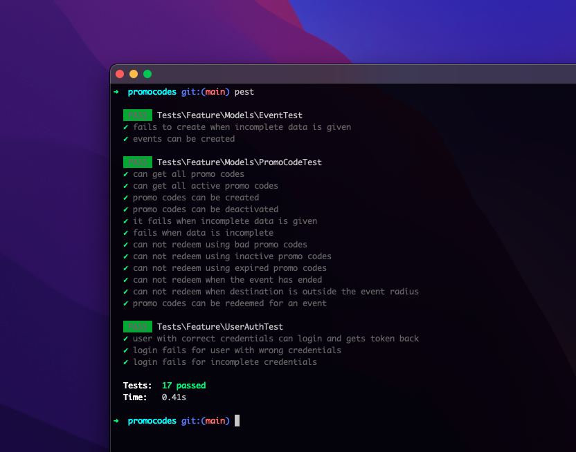

### PromoCodes Case Study
xxxxx wants to give out promo codes worth x amount during events so people can get free rides to and from the event. The flaw with that is people can use the promo codes without going to the event.

[![Contributors][contributors-shield]][contributors-url]
[![Forks][forks-shield]][forks-url]
[![Stargazers][stars-shield]][stars-url]
[![Issues][issues-shield]][issues-url]
#### Test coordinates
- Mulawa mall 0.4121508,32.6414086 (origin)
- Kira Health Center 0.4004731,32.6413863 (event)
- Kira Roundabout 0.4010102,32.6394255 (destination)
- Promo Code Radius 1km

### Tests

These are the current test cases for the promo code system.

https://stackoverflow.com/questions/12439801/how-to-check-if-a-certain-coordinates-fall-to-another-coordinates-radius-using-p
